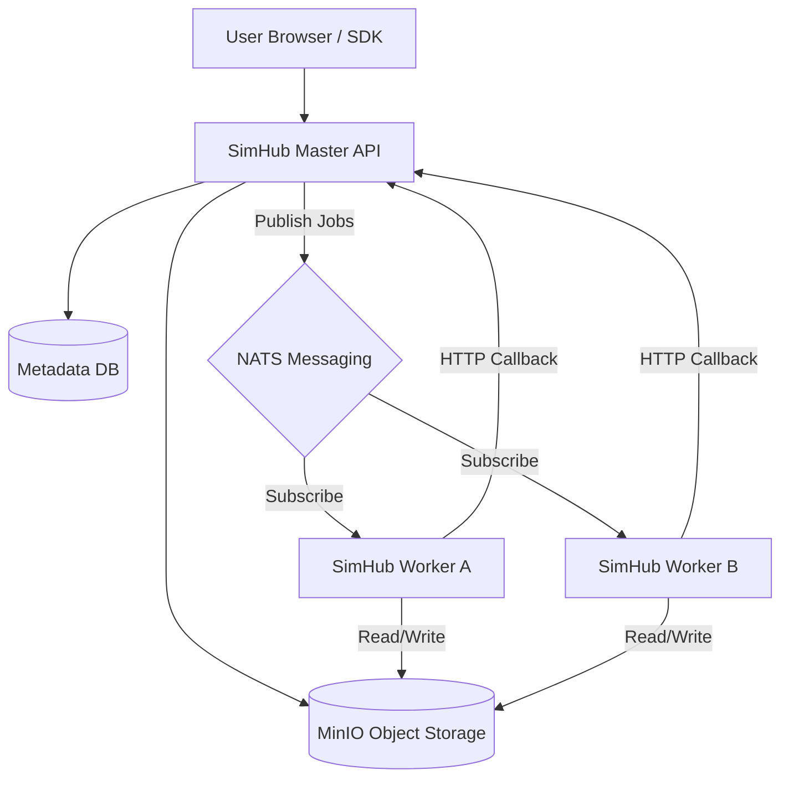

# SimHub 架构设计文档 (Design Document)

## 1. 架构概述 (Architecture Overview)

SimHub 是一个面向仿真行业的**资源中心与数据工厂**。它采用了现代化的**存算分离 (Storage-Compute Separation)** 与 **分布式插件化 (Distributed Plugin-based)** 架构，旨在解决海量异构仿真数据（如地形图、3D 模型、想定包）的存储、版本控制及自动化预处理难题。

### 设计核心：
*   **存算分离**：存储层（MinIO）负责原始数据持久化，计算层（Worker）负责资源的异步加工。
*   **分布式架构**：通过 NATS 消息中间件实现 Master 与 Worker 的解耦。
*   **Master-Worker 模式**：Master 负责元数据管理与决策，Worker 负责繁重的计算任务。
*   **无状态计算**：Worker 节点不直连数据库，通过标准 API 回调上报处理结果。

## 2. 核心概念与领域模型 (Core Concepts)

### 2.1 实体模型 (Entities)

*   **Resource (资源主表)**：代表一个逻辑资源实体（如“城市三维模型”）。
*   **ResourceVersion (资源版本)**：资源的版本化记录。引入了 **语义化版本 (SemVer)** (如 v1.0.2) 与 **流水号版本 (VersionNum)** (如 5) 双重标识。
*   **ResourceDependency (资源依赖)**：描述资源版本间的有向无环图 (DAG) 关系。例如“想定 A”依赖于“模型 B”和“地形 C”。
*   **ResourceType (资源类型)**：定义资源的属性结构（JSON Schema）、预览配置及处理逻辑。
*   **Sidecar (元数据辅助文件)**：持久化在存储层的 `.meta.json` 文件，用于在数据库丢失时恢复系统状态。

### 2.2 数据库模式 (Database Schema)

| 表名 (Table) | 内容 (Content) | 职责 (Responsibility) |
| :--- | :--- | :--- |
| `resource_types` | 类型定义 | 定义资源 Schema、前端预览组件及分类模式 |
| `resources` | 资源元数据 | 记录名称、分类、标签及所属权 |
| `resource_versions` | 版本追踪 | 记录语义化版本 (SemVer)、物理路径、大小、状态（PENDING/ACTIVE） |
| `resource_dependencies` | 依赖关系 | 记录版本间的父子引用关系，支持版本约束条件 |
| `categories` | 层级分类 | 维护资源的虚拟文件夹目录结构 |

## 3. 核心流程设计 (Core Flow Design)

### 3.1 异步处理与智能感知反馈 (Processing Pipeline)

SimHub 采用了“智能感知式”处理策略：

1.  **上传决策**：Master 接收上传确认请求时，会识别资源类型的 **Handler 配置**：
    *   **无 Handler 类型**：判定为即插即用资源（如想定包、文档），直接标记为 `ACTIVE` 并跳过 NATS 队列。
    *   **有 Handler 类型**：标记为 `PENDING` 并发布 NATS 任务。
2.  **依赖解析**：在版本创建时，同步持久化解析出的依赖树（Dependency Tree）。
3.  **计算执行 (如有)**：NATS 将任务投递给 Worker，执行本地映射的处理工具。
4.  **结果反馈**：Worker 通过 HTTP PATCH 接口回传元数据，Master 更新状态并刷新存储层的 Sidecar。

## 4. 组件详解 (Component Breakdown)

### 4.1 Master (API 节点)
*   **身份管理**：集成 MinIO STS 协议，签发临时的上传/下载令牌，确保数据泄密风险降至最低。
*   **无状态扩展**：API 节点不持有任务状态，通过分布式锁或任务队列保证任务不重。
*   **同步机制**：支持从存储桶一键扫描，通过 Sidecar 文件自动重构数据库索引。

### 4.2 Worker (计算节点)
*   **处理器映射 (Handlers)**：Worker 在本地维护 `TypeKey -> Executable` 的映射，实现处理能力的分布式负载均衡。
*   **环境隔离**：不同的 Worker 可以拥有不同的物理环境（如 GPU、专业仿真驱动），Master 只需要发送“意图”，Worker 自行决定执行路径。

### 4.3 SDK (C++ / Python)
*   **工业级传输**：SDK 层内置了预签名 URL 逻辑与分片管理，支持 GB 级大数据的断点续传。

## 5. 安全与隔离 (Security & Isolation)

*   **存储安全**：桶策略设为私有，所有访问请求必须经过 Master 签发的临时凭证。
*   **指令安全**：API 节点不再向 Worker 发送随机 Shell 命令，Worker 只执行本地允许列表中的处理器，防止命令注入风险。

## 6. 未来展望 (Future Considerations)

*   **计算编排**：引入多阶段 Pipeline 编排（如先哈希、再转码、后归档）。
*   **监控告警**：基于 NATS 延迟和任务积压情况自动触发 Worker 集群的 K8s 扩缩容。
*   **多租户隔离**：在存储层引入资源池划分。
