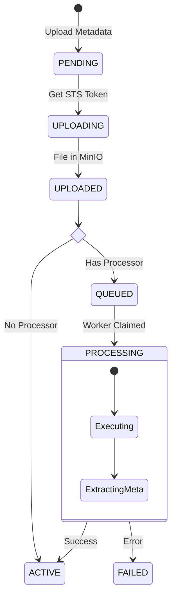

# SimHub 架构设计文档 (Design Document)

## 1. 架构概述 (Architecture Overview)

SimHub 是一个面向仿真行业的**资源中心与数据工厂**。它采用“ **分布式后端** + **模块化前端** ”的总体架构，旨在解决海量异构仿真数据（如地形图、3D 模型、想定包）的存储、版本控制及自动化预处理难题。

### 设计核心
*   **存算分离 (Storage-Compute Separation)**：所有文件资源直接在 MinIO（存储层）与 Worker（计算层）之间流动，API Server 仅负责元数据管理与鉴权（STS Token）。
*   **双模前端 (Dual-Mode Frontend)**：前端采用“微内核 (Micro-Kernel)”设计，支持**原生 Vue 模块**与**外部 Iframe 集成**的混合运行模式。
*   **配置驱动 (Configuration Driven)**：系统行为（包含菜单、路由、处理器管线）高度依赖可动态加载的配置文件，实现运行时扩展。

```mermaid
graph TD
    User[用户浏览器] --> Front[SimHub Web (Vue3)]
    
    subgraph Frontend Architecture
      Front --> Core[Core Kernel\n(ModuleManager/Auth/Http)]
      Core -- Load --> Config[Modules Config JSON]
      Core -- Mount --> ModA[Internal Module\n(Scenario/Resource)]
      Core -- Embed --> ModB[External Module\n(Terrain View/Iframe)]
    end

    Front --> API[Master API]
    API --> DB[(Metadata DB)]
    API --> MinIO[(S3 Storage)]
    
    subgraph Compute Cluster
      API -- NATS --> Worker[Worker Nodes]
      Worker -- Spawn --> Proc[Binary Processors]
    end
```

## 2. 核心概念与领域模型 (Core Concepts)

### 2.1 实体模型 (Entities)
*   **Resource (资源)**：逻辑资产容器，拥有全局唯一 ID、Owner、Tags。
*   **ResourceVersion (版本)**：资源的不可变快照。
    *   **SemVer**: 如 `v1.0.2`，面向用户的发布版本。
    *   **BuildNum**: 如 `build-52`，面向 CI/CD 的流水线版本。
*   **Module (模块)**：前端的功能单元，可以是内部开发的 Vue 组件包，也可以是独立的外部 Web 应用（如地形编辑器）。
*   **Sidecar (元数据副本)**：持久化在 MinIO 中的 `.meta.json` 文件，是灾难恢复的信任源 (Source of Truth)。

### 2.2 数据库模式 (Database Schema)
| 表名 | 职责 | 关键字段 |
| :--- | :--- | :--- |
| `resources` | 资源主表 | `id`, `name`, `type_key`, `owner_id` |
| `resource_versions` | 版本记录 | `version`, `state` (PENDING/ACTIVE), `meta_json` |
| `resource_dependencies` | 依赖关系 | `source_ver_id`, `target_ver_id`, `constraint` |
| `modules` (Config) | 模块注册 | `key`, `integration_mode` (internal/iframe), `url` |

## 3. 前端架构 (Frontend Architecture)

前端工程 (`web/`) 采用 **Vue 3 + TypeScript** 技术栈，遵循**模块化单体 (Modular Monolith)** 架构。

### 3.1 目录结构分层
SimHub 前端严格区分“基础设施”与“业务领域”：

```text
web/src/
├── core/                # [Kernel] 核心基础设施，业务无关
│   ├── moduleManager.ts # 模块加载器，负责路由动态注册与菜单生成
│   ├── bridge/          # Iframe 通信桥接
│   ├── utils/           # Axios 封装 (request.ts) 等
│   └── views/           # 通用容器 (IframeContainer.vue)
├── modules/             # [Domain] 独立业务模块
│   ├── scenario/        # 针对特定资源类型的定制化 UI
│   └── terrain/         # 地形相关业务 (或独立子应用)
└── components/          # [UI System] 通用组件库
    └── resource/        # 资源通用业务组件 (ResourceList, DetailDrawer)
```

### 3.2 动态模块加载机制 (Dynamic Module Loading)
`ModuleManager` 是前端的核心引擎，它在应用启动时执行以下流程：

1.  **Fetch Config**: 从后端（或本地配置文件）拉取模块定义列表。
2.  **Strategy Match**:
    *   **Internal Mode**: 查找本地 `implementations` 映射，激活对应的 Vue 路由与组件。若配置了 `internal` 但未找到特定实现，系统会自动降级使用 **Generic ResourceList**（通用资源视图），大大降低了新资源类型的接入成本。
    *   **Iframe Mode**: 自动生成 `/ext/:key` 路由，挂载 `IframeContainer` 并注入目标 URL。
3.  **Route Injection**: 使用 `router.addRoute` 动态注入路由。
4.  **Menu Generation**: 动态聚合所有活跃模块的菜单项。

### 3.3 交互设计模式 (UX Patterns)
*   **Drawer First**: 资源详情默认使用右侧抽屉（Drawer）展示，保持用户在列表页的上下文（Context）不丢失，提供沉浸式体验。
*   **Skeleton Loading**: 在数据加载期间必须通过骨架屏（ResourceSkeleton）提供视觉占位，避免布局跳动，提升感官性能。

## 4. 核心流程与状态机 (Flows & State Machine)

### 4.1 资源生命周期
资源上传后，根据是否配置了处理器（Processor），会经历不同的状态流转：



## 5. 接口与协议 (Protocols)

### 5.1 Worker-Processor 协议 (JSON-RPC over Stdio)
为了支持异构语言（C++, Python）的集成，Worker 通过标准输入输出与外部进程交互。

**Input (Stdin):**
```json
{
  "request_id": "job-123",
  "command": "process",
  "source_path": "/local/cache/input.glb",
  "output_dir": "/local/cache/output/",
  "params": { 
      "texture_compression": "true",
      "lod_level": 3 
  }
}
```

**Output (Stdout):**
```json
{
  "status": "success",
  "code": 0,
  "metadata": { 
    "poly_count": 52000, 
    "thumbnail_path": "preview.png",
    "textures": ["diffuse.jpg", "normal.png"] 
  },
  "artifacts": [
    { "path": "lod0.glb", "tag": "lod_high" },
    { "path": "preview.png", "tag": "thumbnail" }
  ]
}
```

## 6. 技术栈总结 (Tech Stack)
*   **Backend**: Go 1.25+, NATS (JetStream), MinIO, SQLite/MySQL
*   **Frontend**: Vue 3.4+, Vite, TypeScript, Element Plus
*   **Protocol**: RESTful API (Control Plane), JSON-stdio (Data Plane)
*   **Deployment**: Docker Compose, K8s (Future)
