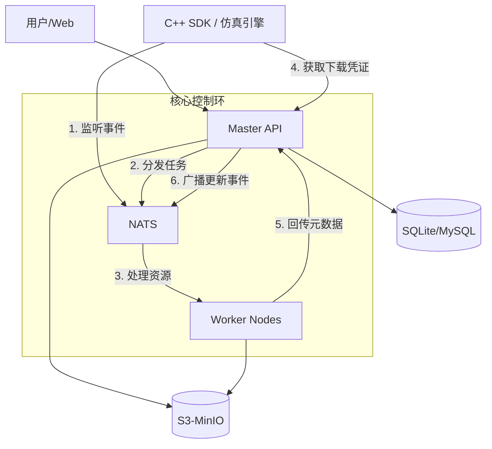

# SimHub 架构设计文档 (Advanced Design Document)

## 1. 架构愿景与设计理念 (Architectural Vision)

SimHub 并非简单的文件存储仓库，它被定义为仿真生态系统的**资源工厂 (Resource Factory)** 与 **状态中枢 (State Hub)**。

### 核心设计原则 (Design Principles)
*   **存算分离 (Storage-Compute Separation)**：
    *   **Control Plane (控制平面)**: Master API 负责事务一致性、RBAC、元数据索引。
    *   **Data Plane (数据平面)**: MinIO 直接承载海量二进制流，Worker 节点动态挂载存储桶进行处理。
*   **事件驱动 (Event-Driven Architecture)**：系统不鼓励轮询。Master 在每一关键生命周期节点（创建、处理完成、版本激活）均向 NATS 广播事件。
*   **元数据抗熵 (Metadata Anti-Entropy)**：数据库不是唯一的真理。每一份资源在存储侧均配有 `.meta.json` Sidecar，确保存储层具备**自我描述能力**，支持从零重建索引。
*   **内容寻址与版本不可变 (Content-Addressable & Immutable)**：追求资源版本的物理不可变，变更即产生新版本，确保仿真作业的回放一致性。

---

## 2. 总体拓扑 (System Topology)



---

## 3. 关键模块详述 (Key Modules)

### 3.1 资源管家 (Resource Steward)
不同于标准 CRUD，Steward 模块提供了一套针对复杂仿真目录结构的治理接口：
*   **Logical Namespace**: 目录即命名空间，支持跨分类移动 (`/api/v1/resources/:id/move`) 且不破坏链接。
*   **Metadata Patching**: 支持针对特定版本（如地形的高斯投影参数）进行增量 JSON 合并修改。
*   **Batch Cleanup**: 针对临时性实验资源，支持依据 TypeKey 进行全库秒级清空。

### 3.2 生命周期事件 (Lifecycle Notifications)
基于 NATS JetStream 实现可靠的消息投递：
*   `resource.created`: 资源容器初始化。
*   `version.uploaded`: 二进制文件已落盘，触发后台流水线。
*   `version.activated`: 处理成功且已生效，SDK 收到此信号后执行**无感热加载**。
*   `version.failed`: 处理异常。

### 3.3 拓扑管理 (Topology & Dependency)
系统维护一个多层级有向无环图 (DAG)：
*   **引用追踪**: 想定版本 $V_s$ 显式声明依赖地形版本 $V_t$。
*   **层级清理**: 删除被引用的底层资源（如基础模型）时，系统会触发依赖告警，防止仿真环境引用失效。
*   **打标下载 (Bundle)**：一键将资源及其所有递归依赖打包为预签名的 URL 集合。

---

## 4. 前端工程艺术 (Frontend Engineering)

前端工程 (`web/`) 追求**极致感官性能 (Perceived Performance)** 与 **模块化可扩展性**。

### 4.1 核心驱动逻辑
*   **ModuleManager**: 动态核心。通过识别后端下发的 `CategoryMode` (Tree or Flat)，在同一页面动态切换“文件夹视图”与“库表视图”。
*   **JSZip Optimizer**: 针对大型压缩包预览，采用前端流式解析技术。利用浏览器的 Service Worker 或 JSZip 库，在不下载整包的情况下，展示压缩包内部结构。

### 4.2 UI/UX 设计哲学
*   **プレミアム・デザイン (Premium Design)**: 采用暗色系 (Obsidian Theme) 为主色调，大量应用 CSS 变量维持设计系统一致性。
*   **Vibrant Interactions**: 
    *   **Glassmorphism**: 头部导航栏与侧边栏采用磨砂玻璃效果。
    *   **Micro-animations**: 使用 Framer Motion 式的渐变过渡，确保弹窗、状态切换平滑无感。

---

## 5. 存储策略 (Storage Strategy)

### 5.1 路径规约
```text
/simhub/
  ├── scenario/
  │   └── {resource_id}/
  │       ├── v1.0.0/
  │       │   ├── main.zip
  │       │   └── .meta.json (Sidecar)
  │       └── v1.1.0/
  │           ├── main.zip
  │           └── .meta.json
  └── cache/ (针对分片上传的临时缓冲区)
```

### 5.2 安全链路
*   **STS Flow**: 用户上传时，API 通过 MinIO STS 生成有效期 30min 的 `AccessKey/SecretKey/SessionToken`。
*   **Browser-Direct-Upload**: 前端利用 `minio-go` (JS) 或标准 S3 Multipart 协议，绕过后端直接将数百 GB 内容推送至 S3。

---

## 6. 技术规格 (Technical Specs)

| 组件 | 选型 | 备注 |
| :--- | :--- | :--- |
| **消息中间件** | NATS (JetStream) | 用于任务分发与实时感知的极轻量总线 |
| **存储接口** | S3 API (MinIO) | 通用工业级存储标准 |
| **元数据引擎** | GORM + SQLite/MySQL | 保证索引的高性能检索 |
| **前端运行时** | Vue 3 + Vite | 毫秒级热更新体验 |
| **SDK 语言支撑** | C++, Golang, Python | 满足仿真引擎、管家服务及算法 Worker |
