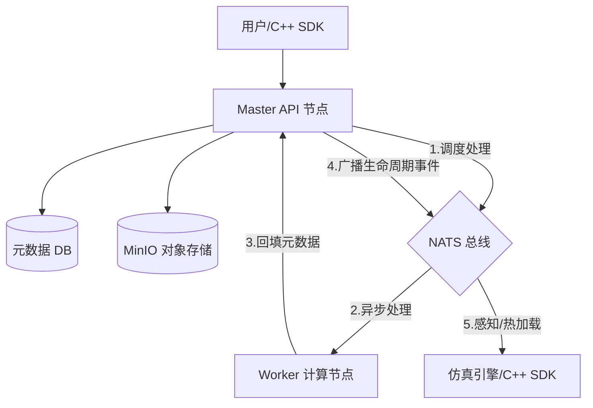

# SimHub - 分布式仿真资源工厂 (Distributed Simulation Resource Factory)


**SimHub** 是一个面向仿真系统的**分布式资源管理中心与事件中枢**。它采用**存算分离 (Storage-Compute Separation)** 与 **事件驱动 (Event-Driven)** 架构，旨在解决海量异构仿真资源（如地形图、3D 模型、想定包）的存储、版本追溯、自动化治理及实时分发难题。

通过高度工程化的设计，SimHub 不仅是一个存储库，更是一个资源全生命周期的控制引擎，能够直接驱动仿真实验流水线的自动化运行。

---

## 🏗 系统架构 (Architecture)

SimHub 采用 Master-Worker 分布式架构，通过 NATS 实现任务调度与生命周期事件的深度解耦。



## 🌟 核心内涵 (Core Capabilities)

### 1. 资源全生命周期感知 (Lifecycle Events)
*   **事件驱动**: 内置基于 NATS 的消息发射器，支持 `resource.created`、`version.activated`、`resource.updated` 等事件。
*   **实时闭环**: C++ SDK 可订阅事件流，实现资源的**全自动发现与无感热加载**，彻底解决仿真节点数据同步滞后问题。

### 2. 拓扑依赖管理与可视化 (Dependency Graph)
*   **依赖追溯**: 支持资源间的父子引用关系（如：想定引用地形、地形引用模型）。
*   **拓扑视图**: 提供交互式的拓扑图，直观展示资源依赖链路，防止意外删除底层公用资产导致的上层崩溃。

### 3. 资源管家 API (Resource Steward)
*   **精细化管控**: 专为 SDK 与自动化脚本设计的管理 API，支持动态更名、跨分类移动、元数据异步回填。
*   **目录即命名空间**: 支持在不同目录下存放同名资源，实现逻辑隔离与路径寻址。

### 4. 存算分离与灾备
*   **STS 直传**: 采用 MinIO STS 签发临时凭证，前端直传存储，数据路径极致优化。
*   **Metadata Sidecar**: 元数据实时同步至存储侧 (`.meta.json`)，确保存储层具备自我描述与反向恢复能力。

### 5. 极致 Web 预览感官
*   **客户端 ZIP 解析**: 采用 JSZip 即使预览压缩包内文件，利用 MinIO CORS 支持，无需后端二次处理即可实时预览大型想定包中的图片与配置。

---

## 🛠 技术栈 (Tech Stack)

*   **Backend**: Go 1.25 (Standard CLI/API), Gin, GORM, NATS
*   **Frontend**: Vue 3, Element Plus, Vite, V-Network-Graph (拓扑可视化)
*   **Storage**: MinIO (S3 兼容)
*   **SDK**: C++ SDK (libcurl, nlohmann/json) 支持 NATS 实时事件监听

---

## 📂 项目结构 (Project Structure)

```text
/
├── apps/               # 独立子应用 (地形可视化、Demo 库)
├── cmd/                # 入口程序 (api, worker)
├── internal/           # 核心模块
│   └── modules/
│       └── resource/   # 资源管理核心 (Steward, Events, Scheduler)
├── pkg/                # 基础设施层 (storage, mq)
├── sdk/                # 跨语言接口 (C++ SDK)
└── web/                # 现代暗色系前端管理门户
```

---

## 🚀 核心原则 (Engineering Principles)

*   **开放 (Open)**: 采用标准 REST、JSON 与 NATS 协议，支持任何语言编写的 Worker 和 SDK 接入。
*   **灵活 (Flexible)**: 目录即命名空间，Type-based 动态布局，完美适配异构仿真数据。
*   **工程化 (Engineered)**: 追求“内容寻址与版本不可变”，每一行资源代码都为百万次下载与生产灾备而设计。

## 📄 许可证 (License)

MIT License
