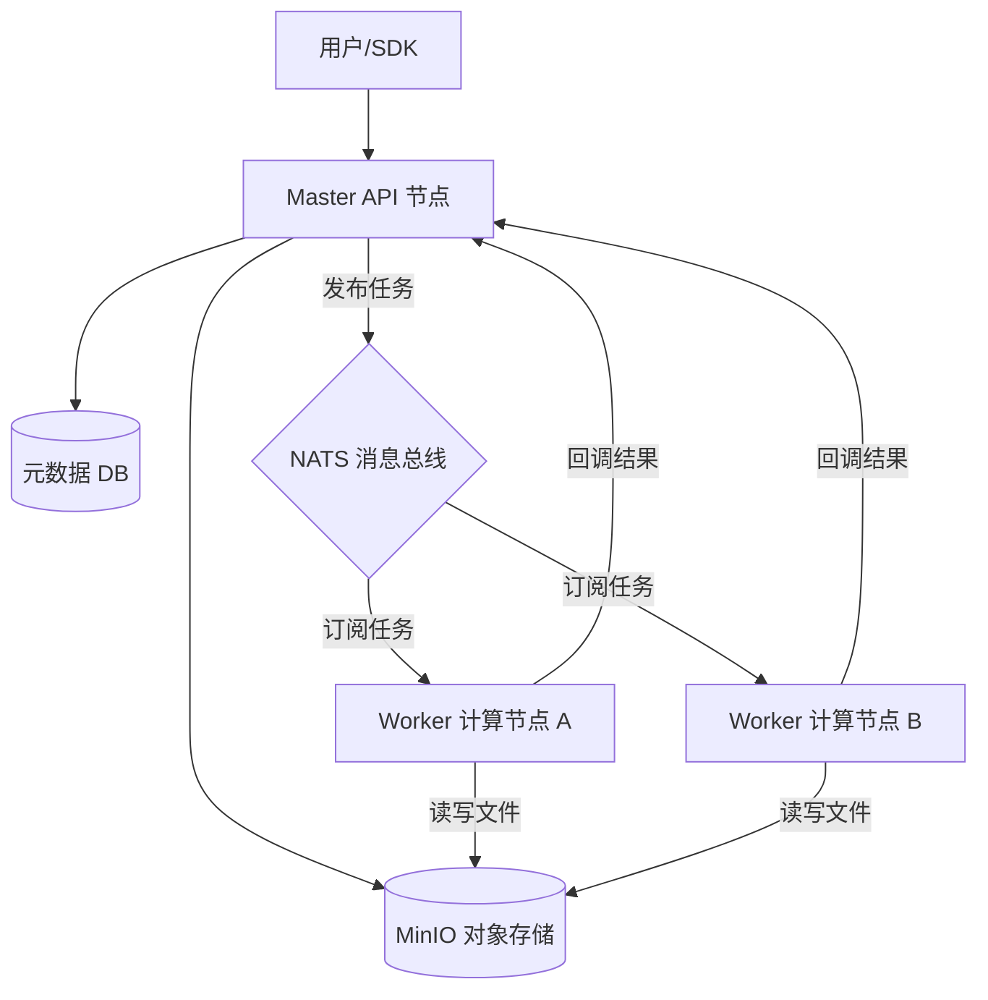

# SimHub - 分布式仿真资源工厂 (Distributed Simulation Resource Factory)


**SimHub** 是一个面向仿真行业的**分布式资源中心与数据工厂**。它采用先进的**存算分离 (Storage-Compute Separation)** 架构，旨在解决海量异构仿真数据（如地形图、3D 模型、想定包）的存储、版本控制、自动化处理及分发难题。

通过标准化协议，SimHub 能够无缝集成各类异构仿真处理器（Processor），将静态的文件资源转化为动态的、可被仿真引擎直接消费的高价值资产。

## 🏗 系统架构 (Architecture)

SimHub 采用 Master-Worker 分布式架构，通过 NATS 消息总线实现高并发的任务调度与解耦。



## 🌟 核心特性 (Key Features)

*   **⚡️ 存算分离架构**:
    *   **Master-Worker**: API 节点负责元数据与鉴权，Worker 节点负责繁重的资源解析与转换。
    *   **NATS 驱动**: 内置异步任务队列，支持削峰填谷，轻松应对数千并发上传。
*   **📂 虚拟文件系统**: 
    *   支持 **Tree (树形)** 与 **Flat (扁平)** 两种视图模式，适应不同类型资源的管理需求。
    *   提供类似 Windows 文件管理器的流畅 Web 体验。
*   **🔌 异构处理器集成 (Processor)**:
    *   支持通过标准 JSON 协议集成 C++、Python 等任意语言编写的外部工具。
    *   自动化提取资源元数据（如模型面数、想定实体数、地形指纹）。
*   **🛡️ 企业级数据安全**:
    *   **STS 直传**: 采用 MinIO STS (Security Token Service) 签发临时凭证，前端直传存储桶，数据流不经过后端。
    *   **Metadata Sidecar**: 核心元数据实时同步至对象存储 (`.meta.json`)，具备从存储层反向恢复数据库的灾难恢复能力。
*   **🏷️ 智能检索**: 基于 SQLite/MySQL 的高性能标签系统，支持多维度组合搜索。

## 🛠 技术栈 (Tech Stack)

*   **Backend**: 
    *   **Core**: Go 1.25+
    *   **Web Framework**: Gin
    *   **ORM**: GORM (SQLite / MySQL / PostgreSQL)
    *   **Messaging**: NATS
*   **Frontend**: 
    *   **Framework**: Vue 3 (Composition API)
    *   **UI Library**: Element Plus
    *   **Build Tool**: Vite
*   **Storage**: MinIO (S3 Compatible)
*   **SDK**: C++ SDK (libcurl, nlohmann/json) 用于仿真引擎原生集成。

## 🚀 快速开始 (Getting Started)

### 环境依赖

*   **Go** 1.25+
*   **Node.js** 18+
*   **MinIO** Server
*   **NATS** Server

### 1. 启动基础设施 (Infrastructure)

```bash
# 启动 MinIO (示例)
minio server /data --console-address ":9001"

# 启动 NATS (示例)
nats-server
```

### 2. 启动后端服务 (Backend Services)

SimHub 包含两个核心组件：API 服务和 Worker 服务。

#### 启动 API Server (Master)
```bash
# 自动迁移数据库结构 simhub.db
go run cmd/simhub-api/main.go
```
*服务默认运行在 `http://localhost:30030`*

#### 启动 Worker Server (Compute Node)
```bash
# Worker 负责处理资源解析任务
go run cmd/simhub-worker/main.go
```

### 3. 启动前端 (Frontend)

```bash
cd web
npm install
npm run dev
```
*访问管理界面: `http://localhost:5173`*

## ⚙️ 核心配置 (Configuration)

资源类型定义在 `config-api.yaml` (或数据库) 中。SimHub 启动时会根据配置自动注册处理逻辑：

```yaml
resource_types:
  - type_key: "scenario"
    type_name: "仿真想定"
    category_mode: "flat"           # 扁平模式
    process_conf:
      pipeline: ["scenario-processor"] # 对应的 Worker 处理器链
  - type_key: "model_glb"
    type_name: "3D模型"
    category_mode: "tree"           # 树形模式
    process_conf:
      pipeline: ["model-optimizer"]
```

## 📂 项目结构 (Project Structure)

```text
/
├── apps/               # 独立应用
│   ├── terrain/        # 地形可视化/处理应用 (Vue Sub-app)
│   └── demo-repo/      # 静态演示仓库
├── cmd/                # 应用程序入口
│   ├── simhub-api/     # Master API Server
│   ├── simhub-worker/  # Worker Compute Node
│   └── simhub-cli/     # 命令行工具
├── internal/           # 核心业务代码
│   ├── modules/        # 模块化业务逻辑 (Resource, Category等)
│   ├── worker/         # Worker 任务消费逻辑
│   └── data/           # 数据访问层
├── pkg/                # 公共库
│   ├── storage/        # MinIO 存储抽象
│   └── mq/             # NATS 消息队列封装
├── drivers/            # 外部处理器 (Processors)
│   └── scenario-processor/ # 示例 C++ 处理器
├── sdk/                # 客户端 SDK
│   └── cpp/            # C++ 集成 SDK
└── web/                # 主前端工程 (Vue 3)
```

## 🧪 测试 (Testing)

*   **单元测试**:
    ```bash
    go test ./internal/...
    ```
*   **压力测试**:
    ```bash
    go run tests/stress/main.go -c 50
    ```

## 🤝 贡献 (Contributing)

欢迎提交 Pull Request 或 Issue。对于重大架构变更，请先开启 Issue 讨论方案。

## 📄 许可证 (License)

MIT License
