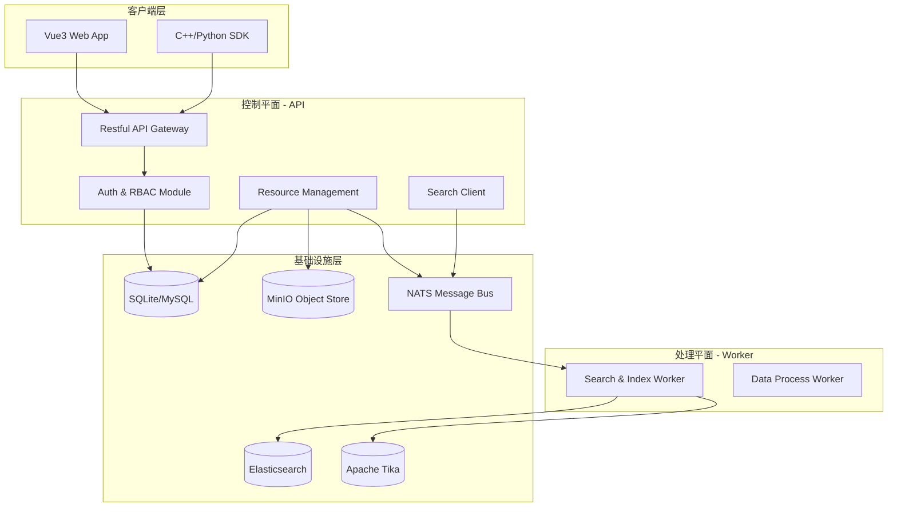

# 01 架构概览 (Architecture Overview)

## 1. 核心愿景 (Core Vision)
SimHub 被定位为仿真生态系统中的**资源工厂 (Resource Factory)** 与 **状态中枢 (State Hub)**。它不仅解决了仿真资产的存储问题，更通过全生命周期的元数据管理、依赖关联及分布式处理能力，为现代化仿真实验提供统一的基础支撑。

## 2. 设计原则 (Design Principles)

### 2.1 存算分离 (Storage-Compute Separation)
- **控制平面 (Control Plane)**: 负责事务、权限、元数据索引。
- **数据平面 (Data Plane)**: 由高性能对象存储 (MinIO) 承载二进制流，Worker 节点根据任务动态挂载和处理。

### 2.2 事件驱动 (Event-Driven)
系统核心链路基于 NATS 消息总线，通过订阅发布机制实现 Master 与 Worker 之间的异步解耦，确保系统具备极高的横向扩展性。

### 2.3 内容寻址与版本不可变 (Content-Addressable & Immutable)
每一份资源版本在物理上是不可变的。任何修改都会产生新的版本 ID，确保存仿作业的回放一致性（Reproducibility）。

## 3. 逻辑架构 (Logical Architecture)

## 4. 技术栈选型 (Technology Stack)

| 领域 | 技术选型 | 理由 |
| :--- | :--- | :--- |
| **后端语言** | Golang | 高并发处理能力及出色的工程化效率 |
| **前端框架** | Vue 3 + Vite | 毫秒级热更新与优秀的响应式体验 |
| **对象存储** | MinIO (S3 API) | 兼容 AWS S3 标准，私有化部署便捷 |
| **消息中间件** | NATS | 超轻量、高性能，支持 RPC 模式工作流 |
| **搜索引擎** | Elasticsearch | 强大的全文检索与聚合分析能力 |
| **文档提取** | Apache Tika | 工业级文档解析，支持 1000+ 格式 |
| **数据库** | GORM + SQLite/MySQL | 兼顾开发便捷性与生产稳定性 |
