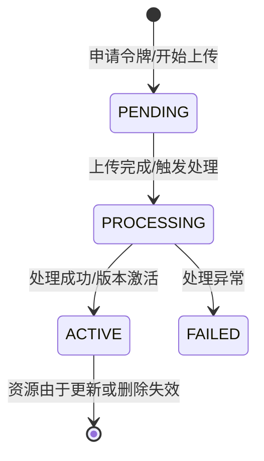

# 02 资源管理模型 (Resource Management)

## 1. 资源模型核心概念

### 1.1 资源 (Resource)
资源是管理的基本单元，代表一个逻辑对象（如“坦克模型 A”、“北京地图”）。
- **属性**: `ID`, `Name`, `TypeKey`, `CategoryID`, `Tags`, `Scope` (PUBLIC/PRIVATE).

### 1.2 资源版本 (ResourceVersion)
资源是可演进的，每个物理状态对应一个版本。
- **属性**: `ID`, `VersionNum`, `SemVer`, `FilePath` (S3存储路径), `FileSize`, `State` (PENDING/ACTIVE/FAILED), `MetaData` (自定义元数据).

### 1.3 资源类型 (ResourceType)
系统通过 `modules.yaml` 灵活定义不同的资源类型。
- **元数据定义 (SchemaDef)**: 决定该类型资源独有的元数据结构。
- **上传模式 (UploadMode)**: 支持单文件、分片上传或文件夹。

## 2. 依赖管理 (Dependency Management)

SimHub 维护一个复杂的资源版本间依赖图。
- **显式引用**: 用户或系统自动声明资源 A 依赖资源 B。
- **版本约束**: 支持 `latest` 或指定语义化版本范围。
- **级联打包 (Bundle)**: 递归解析依赖树，支持一键导出包含所有依赖的完整资源包（ZIP 格式）。

## 3. 生命周期状态机

- **PENDING**: 用户已获取上传凭证，但文件尚未完整落盘。
- **PROCESSING**: 文件已到达 MinIO，Worker 正在执行文本提取、格式验证或拓扑解析。
- **ACTIVE**: 资源准备就绪，可供前端预览、SDK 下载和仿真引用。

## 4. 目录与分类策略
不同于传统操作系统的物理文件树，SimHub 采用逻辑分类 (Categories)：
- **扁平模式 (Flat)**: 适用于标签化的资源管理。
- **树形模式 (Tree)**: 提供类似文件夹的多级目录结构，增强组织性。
