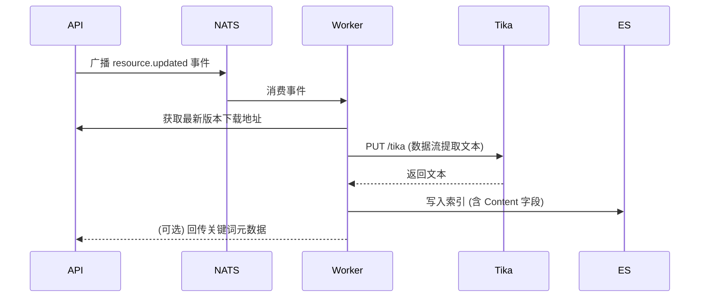

# 04 全文检索与索引 (Search Engine)

## 1. 检索架构
SimHub 的检索系统通过 Elasticsearch (ES) 与 Apache Tika 实现了对非结构化文档内容的深度感知。

## 2. 索引流水线 (Indexing Pipeline)



- **Apache Tika**: 负责从 PDF、Word、Excel 等二进制文件中提取文本片段。
- **ES Worker**: 独立的轻量级进程，负责维护 ES 索引状态与数据库元数据的同步。

## 3. 搜索策略优化

### 3.1 混合搜索语义
为了兼顾精确度和灵活性，API 采用了并集策略：
- **Elasticsearch**: 负责内容、标签的模糊匹配及聚合分析。
- **SQL LIKE**: 负责资源名称的严格子串匹配（尤其在 ES 分词器未涵盖的特殊标识符场景下作为补充）。

### 3.2 高亮实现 (Highlighting)
- **原理**: ES 在搜索时利用 `highlight` 插件计算匹配位置。
- **展示**: API 将高亮片段拼接为 `<em>` 标签片段返回，前端根据这些标签在搜索列表下方展示关联摘要。

## 4. 索引映射 (Mapping)
```json
{
  "properties": {
    "id": { "type": "keyword" },
    "name": { "type": "text", "analyzer": "ik_smart" },
    "tags": { "type": "keyword" },
    "content": { "type": "text", "analyzer": "standard" },
    "created_at": { "type": "date" }
  }
}
```
*注：对于非中文系统，name 字段亦可使用 standard 分词器。*
